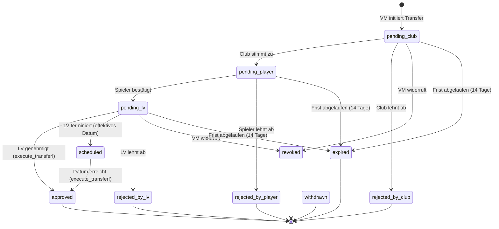
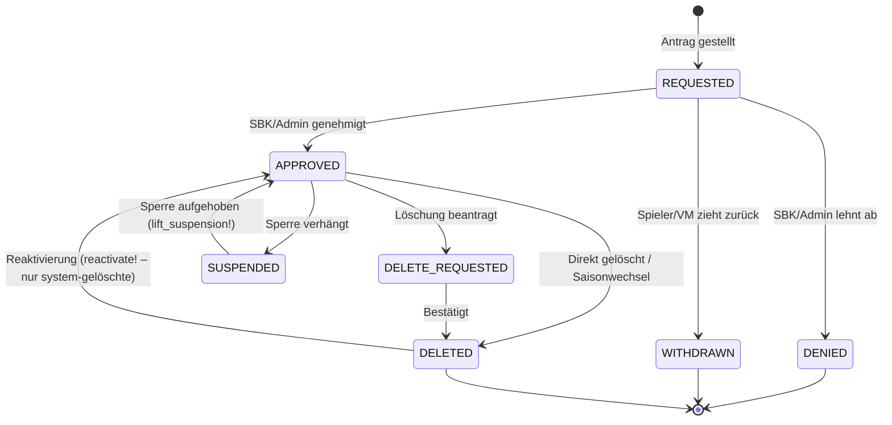

# Datenmodell-Dokumentation

## TransferRequest – State Machine



**Aktive Status** (TransferRequest.active scope): `pending_club`, `pending_player`, `pending_lv`, `scheduled`

## Lizenz-Status-Lifecycle



**Status-IDs:**

| ID | Name | Konstante |
|----|------|-----------|
| 1 | erteilt | `License::APPROVED` |
| 2 | beantragt | `License::REQUESTED` |
| 3 | abgelehnt | `License::DENIED` |
| 4 | ungültig: gelöscht | `License::DELETED` |
| 5 | ungültig: Löschung beantragt | `License::DELETE_REQUESTED` |
| 8 | zurückgezogen | `License::WITHDRAWN` |

**Aktive Status** (`License::ACTIVE_STATUSES`): APPROVED, REQUESTED

## Permission-Resolver

`User#permission_hash` gibt folgende Keys zurück:

| Key | user_group_id | Bedeutung | Scope |
|-----|---------------|-----------|-------|
| `:admin` | 1 | Volladmin | `[0]` = global, sonst `[go_id, ...]` |
| `:sbk` | 2 | Spielbetriebskommission | `[0]` = global (FD-GO), sonst `[go_id, ...]` |
| `:rsk` | 3 | Regel-/Schiedsrichterkommission | wie SBK |
| `:vm` | 4 | Vereinsmanager | `[club_id, ...]` |
| `:tm` | 5 | Teammanager | `[team_id, ...]` (nur current season) |

**Wichtig:** `permission_hash[:vm]` gibt Club-IDs zurück, **nicht** Game-Operation-IDs. Admin- und SBK-User haben ein leeres `:vm`, auch wenn sie auf alle Clubs zugreifen können. Für Clubs von Admin/SBK immer `Club.admin_user_clubs(user)` verwenden.

## JSONB-Schemas

### `Player#licenses` (Array)

```json
[
  {
    "id": "uuid-v4",
    "team_id": 123,
    "season_id": 18,
    "league_class_id": "1",
    "history": [
      {
        "license_status_id": 1,
        "created_at": "2025-09-01T10:00:00Z",
        "created_by": 42,
        "reason": "Genehmigt durch SBK"
      }
    ]
  }
]
```

**Pflichtfelder in History-Einträgen:** `license_status_id`, `created_at`, `created_by`  
**Helper:** `player.append_license_history(license, status:, user_id:, reason:)` garantiert alle Pflichtfelder.

### `Player#clubs` (Array)

```json
[
  {
    "club_id": 5,
    "home_club": true,
    "valid_until": null,
    "valid_set_by": null
  }
]
```

**Invariante:** Maximal ein Eintrag mit `home_club: true` und `valid_until: null` gleichzeitig.

### `Game#events` (Array)

```json
[
  {
    "id": 1,
    "time": "12:34",
    "period": 1,
    "home_goals": 1,
    "guest_goals": 0,
    "event_type": "goal",
    "event_team": "home",
    "home_number": 17,
    "added_at": 1748956800
  }
]
```

`added_at` (Unix-Timestamp) wird seit v1.29+ beim Erstellen gesetzt. Ältere Events ohne `added_at` werden im API-Delay-Filter als "alt genug" behandelt.
